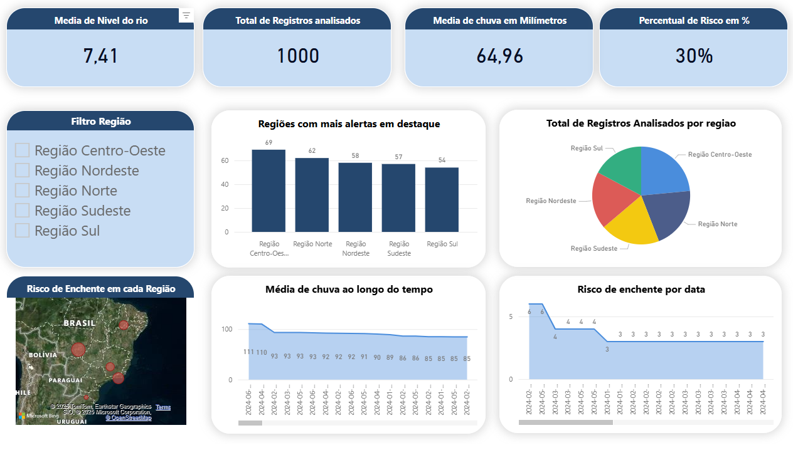

### 📊 Dashboard
O Hydro Safe é nosso painel de alerta inteligente para enchentes: ele reúne dados de chuva e nível de rios, aplica um modelo preditivo (Random Forest) e traduz tudo em um mapa interativo com KPIs de risco por região, para que equipes públicas e privadas saibam onde agir primeiro e com que urgência. No Power BI, você navega por filtros de cidade/período, enxerga os bairros mais vulneráveis, compara severidades e acompanha indicadores de impacto — tudo pensado para tomada de decisão rápida e prática. No vídeo, mostramos de forma simples como ler os cards, explorar o mapa e transformar cada sinal de risco em ação concreta (acionar equipes, avisar moradores, priorizar rotas).

### <u>👉 Para conferir meu dashboard completo interativo no Power BI é só clicar nele</u>

